# TaskPulse - System Architecture & Design

> Stack: Java 17 | Spring Boot 3.2 | PostgreSQL 15 | Redis 7 | Apache Kafka | Resilience4j | Docker | GitHub Actions
>
> Purpose of this document: a single, build-ready reference that describes WHAT TaskPulse is, HOW its pieces fit together, and IN WHAT ORDER to build it. Every diagram maps to concrete classes and files so you can go from design to code without guessing.
>
> Encoding: UTF-8, ASCII-only content (safe to open in IntelliJ with any encoding setting). No BOM.

---

## Table of Contents

1. [How to Read This Document](#1-how-to-read-this-document)
2. [System Context (C4 Level 1)](#2-system-context-c4-level-1)
3. [Container View (C4 Level 2)](#3-container-view-c4-level-2)
4. [UML Class Diagram - Domain Model](#4-uml-class-diagram---domain-model)
5. [UML Class Diagram - Layered Application](#5-uml-class-diagram---layered-application)
6. [Entity Relationship Diagram (ERD)](#6-entity-relationship-diagram-erd)
7. [Sequence Diagrams](#7-sequence-diagrams)
8. [Event-Driven Architecture (Kafka)](#8-event-driven-architecture-kafka)
9. [Resilience & Rate Limiting](#9-resilience--rate-limiting)
10. [Transaction & Data-Access Strategy](#10-transaction--data-access-strategy)
11. [Observability Stack](#11-observability-stack)
12. [Deployment & CI/CD](#12-deployment--cicd)
13. [Project Package Structure](#13-project-package-structure)
14. [Build Roadmap (T1-T16)](#14-build-roadmap-t1-t16)
15. [Key Technology Decisions](#15-key-technology-decisions)

---

## 1. How to Read This Document

- Diagram types used: Mermaid `graph`, `classDiagram`, `erDiagram`, `sequenceDiagram`, and `stateDiagram-v2`. They render natively on GitHub/GitLab, in VS Code (Markdown Preview Mermaid Support), IntelliJ (Markdown plugin has Mermaid built in - enable it in Settings > Languages & Frameworks > Markdown), and Obsidian.
- UML vs ERD: Sections 4 & 5 are UML class diagrams (object/code structure - fields, methods, visibility, inheritance, dependencies). Section 6 is the ERD (physical database tables - columns, types, keys, cardinality).
- Visibility markers in UML: `+` public, `-` private, `#` protected, `~` package-private. `<<abstract>>`, `<<Entity>>`, `<<interface>>`, `<<enumeration>>` are stereotypes (Mermaid renders these inside guillemets automatically).
- Building order: follow the Build Roadmap (Section 14) - each task (T1-T16) names the exact files to create and which diagram to consult.

---

## 2. System Context (C4 Level 1)

The big picture: who uses TaskPulse and which external systems it talks to.

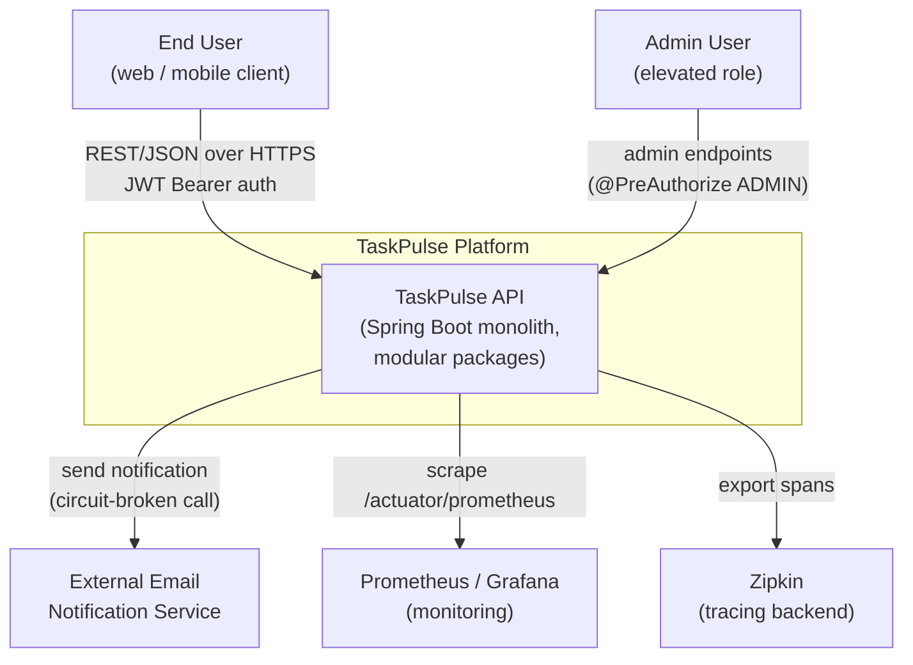

---

## 3. Container View (C4 Level 2)

The runtime processes (containers) and how they communicate. Mirrors `docker-compose.yml`.

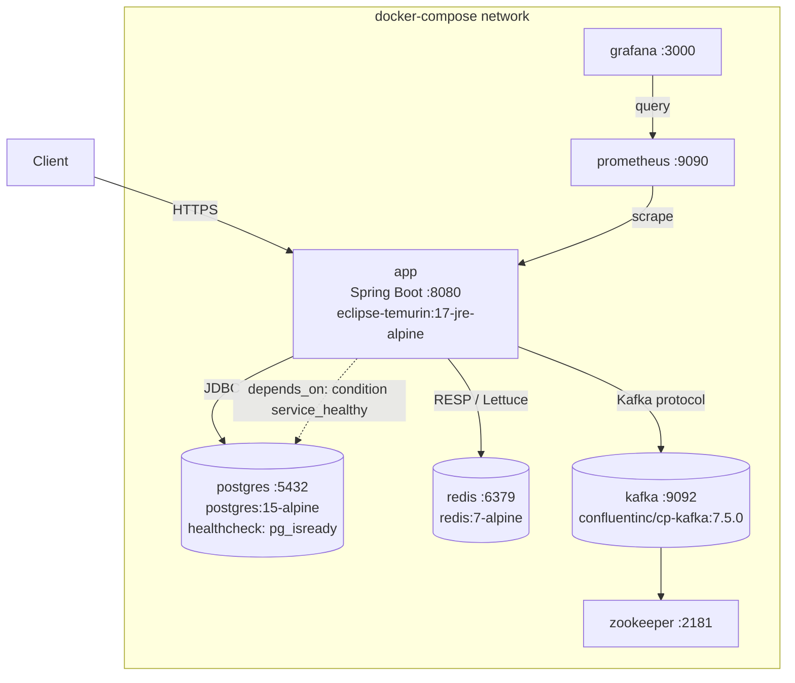

> Note: the `app` service uses `depends_on` with `condition: service_healthy` on Postgres so it never boots before the database is accepting connections.

---

## 4. UML Class Diagram - Domain Model

Object-oriented structure of the entities, their inheritance from a shared `BaseEntity`, and enums. This is the blueprint for the `domain/**` packages (tasks T2, T4).

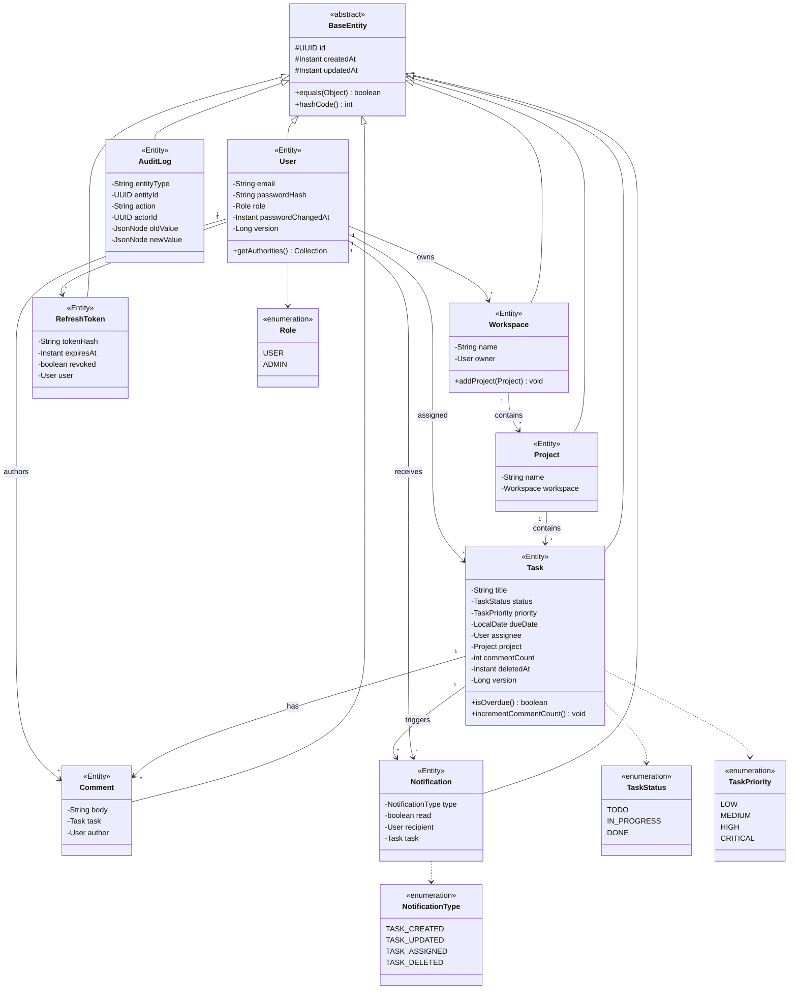

Design rules captured here (from T2):
- `BaseEntity` is `@MappedSuperclass` carrying `id` (UUID), `createdAt`, `updatedAt` with `@CreatedDate`/`@LastModifiedDate` auditing.
- `equals()`/`hashCode()` are based ONLY on `id` (never all fields) to stay Hibernate-proxy-safe.
- Enums persisted with `@Enumerated(EnumType.STRING)` - never `ORDINAL`.
- `Task` carries `@Version` for optimistic locking and `deletedAt` for soft delete.
- No Lombok `@Data` on entities (avoids `toString()` triggering lazy loading).

---

## 5. UML Class Diagram - Layered Application

How a request flows through Controller -> Service -> Repository, plus the security, AOP, caching, and event collaborators. This is the blueprint for `api/**`, `domain/**`, `security/**`, `aop/**`, `infrastructure/**`.

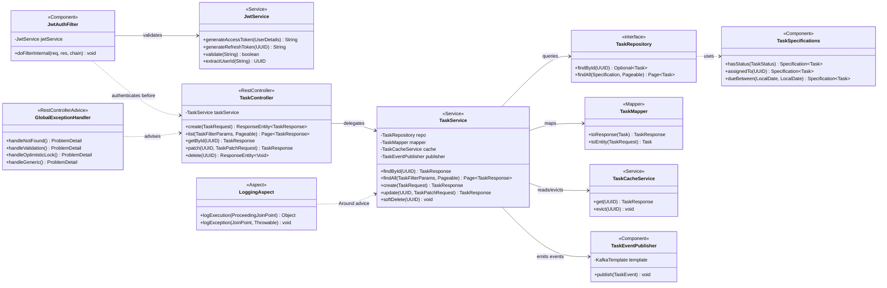

> The same Controller -> Service -> Repository pattern repeats for Auth, Workspace, Project, Comment, and Notification. `TaskService` shows the most collaborators (cache + events), so it is the canonical template. Annotations applied in code: `TaskController` is `@RestController @RequestMapping("/api/v1/tasks")`; `TaskMapper` is `@Mapper(componentModel="spring")`.

---

## 6. Entity Relationship Diagram (ERD)

Physical database schema produced by the Flyway migrations (tasks T3, T10). Types are PostgreSQL types.

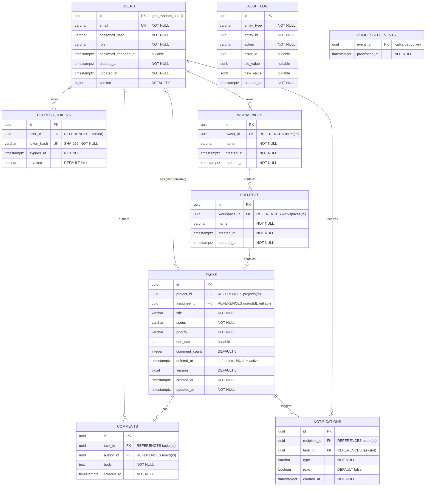

Indexing & constraint strategy (V2 migration):

| Index / Constraint | Definition | Why |
|---|---|---|
| idx_tasks_status | tasks(status) | Filter tasks by status (board columns) |
| idx_tasks_assignee | tasks(assignee_id) | "My tasks" queries |
| idx_tasks_due_date | tasks(due_date) | Overdue / upcoming queries |
| idx_tasks_active | tasks(deleted_at) WHERE deleted_at IS NULL | Partial index - smaller & faster for the common soft-delete filter |
| uq_users_email_active | UNIQUE(email) WHERE deleted_at IS NULL | Enforce email uniqueness only among active users (allows re-registration after soft delete) |
| uq_processed_events | UNIQUE(event_id) | Kafka consumer idempotency / dedup |

---

## 7. Sequence Diagrams

### 7.1 Authentication & Token Rotation (T5)

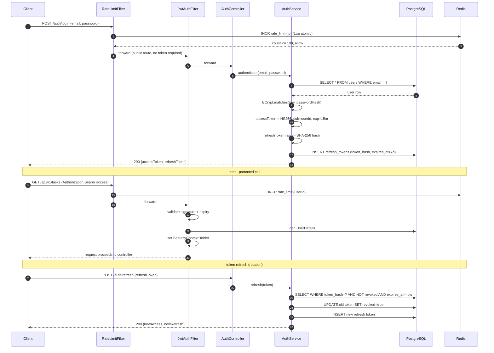

### 7.2 Task Update - Optimistic Lock + Cache + Event (T9, T11, T13)

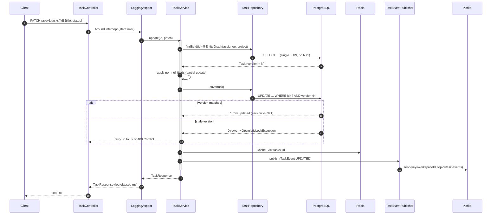

---

## 8. Event-Driven Architecture (Kafka)

Asynchronous notification pipeline (task T13). Events are small records keyed by `workspaceId` so ordering is preserved per workspace.

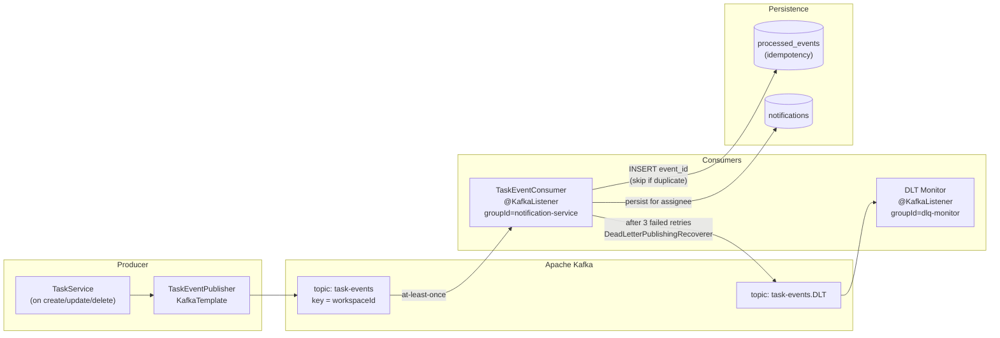

Guarantees: at-least-once delivery + idempotent consumer (dedup table) = effectively-once processing. The `@Transactional` consumer only commits the Kafka offset after the DB write succeeds.

---

## 9. Resilience & Rate Limiting

Outbound calls (for example email) are wrapped in a layered Resilience4j stack; inbound traffic is throttled per user (task T14).

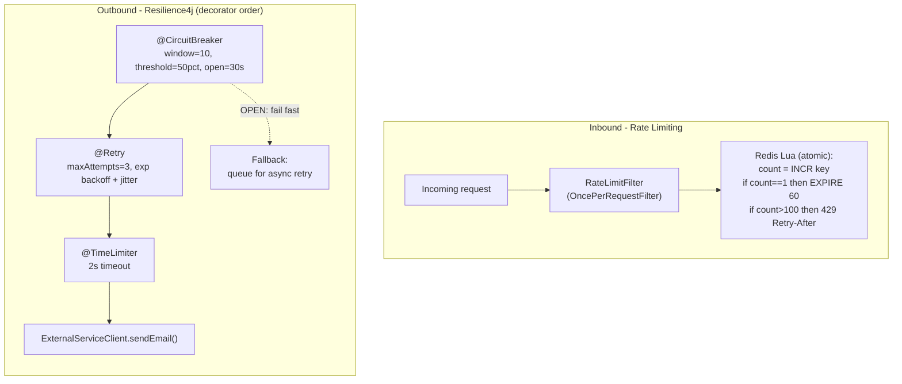

Circuit-breaker state machine:

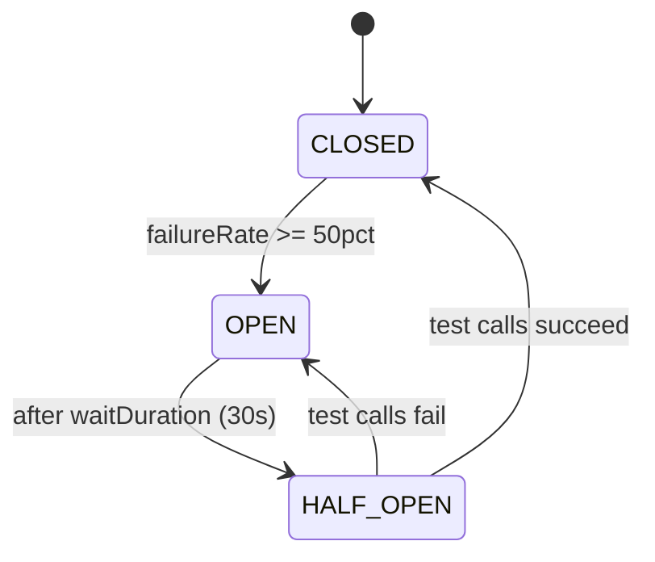

---

## 10. Transaction & Data-Access Strategy

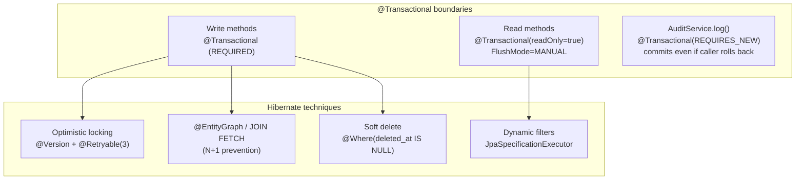

> Self-invocation caveat: `@Transactional`/AOP advice only applies through the Spring proxy. An internal `this.method()` call bypasses it - split such calls into separate beans or inject a self-reference.

---

## 11. Observability Stack

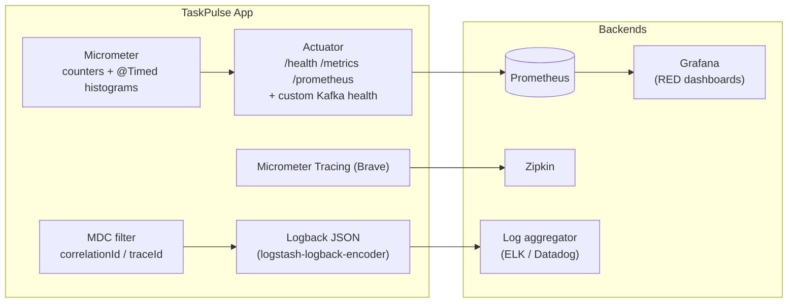

---

## 12. Deployment & CI/CD

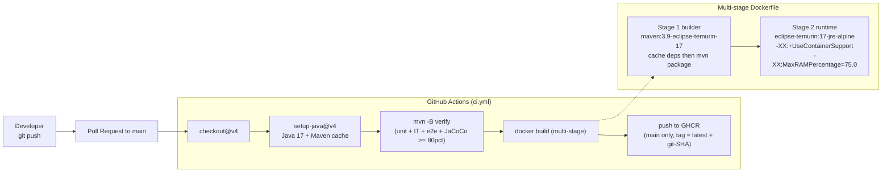

---

## 13. Project Package Structure

```
taskpulse/
  docs/
    ARCHITECTURE.md                 <- this document
  docker-compose.yml                <- postgres, redis, zookeeper, kafka, app
  Dockerfile                        <- multi-stage build
  pom.xml
  .github/workflows/ci.yml
  src/main/java/com/taskpulse/
    TaskPulseApplication.java
    api/
      auth/          AuthController, AuthRequest, AuthResponse
      workspace/     WorkspaceController, WorkspaceRequest/Response
      project/       ProjectController
      task/          TaskController, TaskRequest, TaskResponse, TaskFilterParams
      notification/  NotificationController
    domain/
      common/        BaseEntity
      user/          User, Role, UserRepository, UserService
      workspace/     Workspace, WorkspaceRepository, WorkspaceService
      project/       Project, ProjectRepository, ProjectService
      task/          Task, TaskStatus, TaskPriority, TaskRepository,
                     TaskSpecifications, TaskService, TaskMapper
      comment/       Comment, CommentRepository, CommentService
      notification/  Notification, NotificationType, NotificationService
    security/        JwtService, JwtAuthFilter, RateLimitFilter,
                     WorkspaceSecurityService, RefreshToken, RefreshTokenRepository
    config/          SecurityConfig, RedisConfig, KafkaConfig,
                     ObservabilityConfig, AuditConfig
    aop/             LoggingAspect, AuditAspect, @Auditable
    event/           TaskEvent, TaskEventPublisher, TaskEventConsumer
    infrastructure/
      cache/         TaskCacheService
      resilience/    ExternalServiceClient
    exception/       GlobalExceptionHandler, ApiError,
                     ResourceNotFoundException, BusinessRuleException
  src/main/resources/
    db/migration/    V1__init_schema.sql, V2__add_indexes.sql, V3__audit_log.sql
    application.yml, application-dev.yml, application-prod.yml
    logback-spring.xml
```

---

## 14. Build Roadmap (T1-T16)

Build the project in this order. Each row says which diagram to consult and which files to produce.

| Week | Task | Build | Diagram refs |
|---|---|---|---|
| W1 | T1 Bootstrap | pom.xml, TaskPulseApplication, docker-compose.yml | Section 3 Container |
| W1 | T2 Domain entities | BaseEntity + all @Entity classes & enums | Section 4 Domain UML |
| W1 | T3 Flyway migrations | V1__init_schema.sql | Section 6 ERD |
| W1 | T4 Java 17 / collections | DTO records, Stream-based service stubs | Section 4 |
| W2 | T5 Security + JWT | JwtService, JwtAuthFilter, SecurityConfig, AuthController | Section 7.1 Auth seq |
| W2 | T6 Workspace/Project REST | WorkspaceController/Service, @PreAuthorize | Section 5 Layered UML |
| W2 | T7 Exception handling | GlobalExceptionHandler, ApiError (RFC 7807) | Section 5 |
| W2 | T8 AOP logging/audit | LoggingAspect, AuditAspect | Section 5, Section 10 |
| W3 | T9 Task CRUD + JPA | TaskRepository, TaskSpecifications, TaskController | Section 5, Section 7.2 |
| W3 | T10 Transactions | @Transactional on services, V3__audit_log.sql | Section 10 |
| W3 | T11 Redis caching | RedisConfig, TaskCacheService | Section 7.2 |
| W3 | T12 Test suite | unit / @WebMvcTest / @DataJpaTest / Testcontainers e2e | all |
| W4 | T13 Kafka events | TaskEvent, TaskEventPublisher/Consumer, KafkaConfig | Section 8 Kafka |
| W4 | T14 Rate limit + circuit breaker | RateLimitFilter, ExternalServiceClient | Section 9 Resilience |
| W4 | T15 Observability | ObservabilityConfig, logback-spring.xml | Section 11 Observability |
| W4 | T16 Docker + CI | Dockerfile, .github/workflows/ci.yml, README.md | Section 12 CI/CD |

---

## 15. Key Technology Decisions

| Concern | Choice | Rationale |
|---|---|---|
| Primary DB | PostgreSQL 15 | ACID, UUID PKs, partial indexes, JSONB audit values |
| Schema migrations | Flyway | Versioned, checksum-verified, reproducible environments |
| Caching | Redis 7 | Sub-ms reads; doubles as the rate-limit token store |
| Async messaging | Apache Kafka | Per-workspace ordering, replay, DLQ |
| Auth | JWT (HS256) + rotating refresh tokens | Stateless and horizontally scalable; short access TTL limits theft window |
| ORM | Spring Data JPA / Hibernate | Specifications for dynamic queries; @EntityGraph kills N+1 |
| Redis serialization | Jackson JSON | Schema-flexible, debuggable, version-tolerant vs Java serialization |
| Resilience | Resilience4j | Composable CircuitBreaker + Retry + TimeLimiter + fallback |
| Metrics | Micrometer -> Prometheus -> Grafana | Vendor-neutral; RED dashboards |
| Tracing | Brave -> Zipkin | W3C traceparent; correlates logs across boundaries |
| Logging | Logback + logstash-encoder | Structured JSON with MDC correlationId |
| Container | Multi-stage Docker (JRE Alpine) | Small image; cgroup-aware JVM memory |
| CI | GitHub Actions + JaCoCo >= 80pct | Fail-fast; immutable artifacts tagged by Git SHA |
| Soft delete | deleted_at + @Where + partial unique index | Auto-filtered queries; re-registration after delete |
| Concurrency | Optimistic @Version + @Retryable | Low overhead on the read path; retry on conflict |

---

Document maintained at `taskpulse/docs/ARCHITECTURE.md`. Update diagrams alongside code changes so the design stays the single source of truth.
