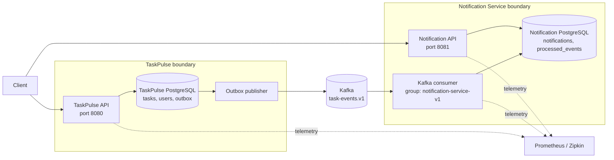

# ADR-001: Extract Notification Service

- Status: Accepted
- Date: 2026-08-11

## Context

TaskPulse currently owns task management, users, workspaces, projects, the transactional outbox, and an unused notification domain model.

Notifications have different operational characteristics from task management:

- Notification processing is asynchronous.
- Temporary notification outages must not block task operations.
- Notification delivery may require independent retry and scaling policies.
- Kafka already provides a durable integration boundary through TaskPulse's transactional outbox.
- Future channels such as email may introduce provider-specific resilience and delivery tracking.

Adding a Kafka listener inside the existing TaskPulse process would create an event-driven component, but it would not provide an independently deployable microservice.

## Decision

Create an independently deployable Notification Service in the TaskPulse monorepo.

Notification Service will:

- Run as a separate Spring Boot process.
- Produce a separate executable JAR and Docker image.
- Own its PostgreSQL database and Flyway migrations.
- Consume versioned TaskPulse integration events from Kafka.
- Use a dedicated Kafka consumer group.
- Store TaskPulse identifiers as UUID values rather than cross-service JPA relationships.
- Process events idempotently using `eventId`.
- Expose notification-specific REST endpoints.
- Validate authentication independently.
- Publish its own health, metrics, logs, and traces.

TaskPulse will remain the owner of users, workspaces, projects, tasks, and task-event publication.

Notification Service will not read from or write to the TaskPulse database.

## Consequences

### Positive

- Task creation remains available while Notification Service is unavailable.
- Notification processing can scale independently.
- Notification failures and retries are isolated from TaskPulse request threads.
- Each service can evolve its persistence model independently.
- Kafka retains events while Notification Service is offline.
- Additional consumers can subscribe without modifying TaskPulse transactions.

### Negative

- Notification data becomes eventually consistent.
- Operations now include another application, database, image, and deployment.
- Event contracts require explicit versioning and compatibility management.
- Duplicate delivery and poison messages must be handled.
- Distributed tracing and debugging become more complex.
- Authentication must work across independently deployed services.
- Cross-service reporting cannot rely on ordinary JPA joins.

## Rejected alternatives

### Kafka listener inside TaskPulse

Rejected as the final design because it shares the same process, database, image, scaling policy, and failure domain. It remains a valid modular-monolith approach but does not meet the microservice learning objective.

### Shared TaskPulse database

Rejected because Notification Service would become coupled to TaskPulse's schema and release lifecycle. Direct table access would bypass TaskPulse's ownership boundary.

### Synchronous notification call from TaskPulse

Rejected because Notification Service downtime would increase task-request latency or cause task creation to fail. It would also recreate the dual-write problem between two databases.

### Distributed transaction across both databases

Rejected because XA/two-phase commit would increase coupling and operational complexity while reducing availability. Local transactions plus durable events provide the desired eventual-consistency model.

## Migration strategy

1. Define a versioned notification-triggering integration event.
2. Publish it through the existing TaskPulse transactional outbox.
3. Build Notification Service with its own database.
4. Add idempotent Kafka consumption.
5. Expose and secure notification REST endpoints.
6. Redirect notification API ownership to the new service.
7. Verify that no TaskPulse code uses the old notification tables.
8. Remove the old TaskPulse notification entity and table through a later migration.

The existing notification model will not be deleted until the replacement service is running and verified.

## Runtime topology

## Initial runtime contract

| Concern | Decision |
|---|---|
| TaskPulse HTTP port | `8080` |
| Notification HTTP port | `8081` |
| Task event topic | `task-events.v1` |
| Partition key | `workspaceId` |
| Notification consumer group | `notification-service-v1` |
| Dead-letter topic | `task-events.v1.notification-service.dlt` |
| Delivery model | At least once |
| Duplicate protection | Unique `eventId` |
| Cross-service database access | Prohibited |
| Synchronous event enrichment | Avoided |

## Ownership matrix

| Capability or data | TaskPulse | Notification Service |
|---|---:|---:|
| Users and roles | Owner | References `recipientId` only |
| Workspaces and projects | Owner | Stores identifiers only when required |
| Tasks and assignments | Owner | Consumes assignment facts |
| Task integration-event publication | Owner | Consumer |
| Transactional task outbox | Owner | No access |
| Notifications | No access after migration | Owner |
| Processed consumer events | No access | Owner |
| Read/unread state | No access after migration | Owner |
| Email delivery state | No access | Future owner |
| Authentication issuance | Current owner | Validator only |
| Notification authorization | No access | Owner |

## Boundary rules

1. Notification Service must not import TaskPulse entities, repositories, services, or database migrations.
2. Notification Service must not connect to the TaskPulse datasource.
3. TaskPulse must not insert, update, or query Notification Service tables.
4. Cross-service communication must use a documented API or versioned event contract.
5. Event payloads may contain deliberate snapshots such as `taskTitle`, but they are historical event data rather than shared entities.
6. Notification Service must treat Kafka delivery as at least once.
7. Duplicate protection must be enforced by a database unique constraint, not only an application-level check.
8. Notification creation and processed-event recording must use one local transaction.
9. Notification Service downtime must not cause TaskPulse task operations to fail.
10. No external email call may execute inside the Kafka consumer's notification database transaction.

## Service invariants

Notification Service is responsible for preserving these invariants:

- One in-app notification per supported `eventId`.
- A Kafka record is not acknowledged before its local transaction commits.
- A malformed or permanently failing record does not block its partition forever.
- A notification can only be read by its intended recipient.
- Retry behavior does not create duplicate notification rows.
- Historical event processing does not require direct TaskPulse database access.